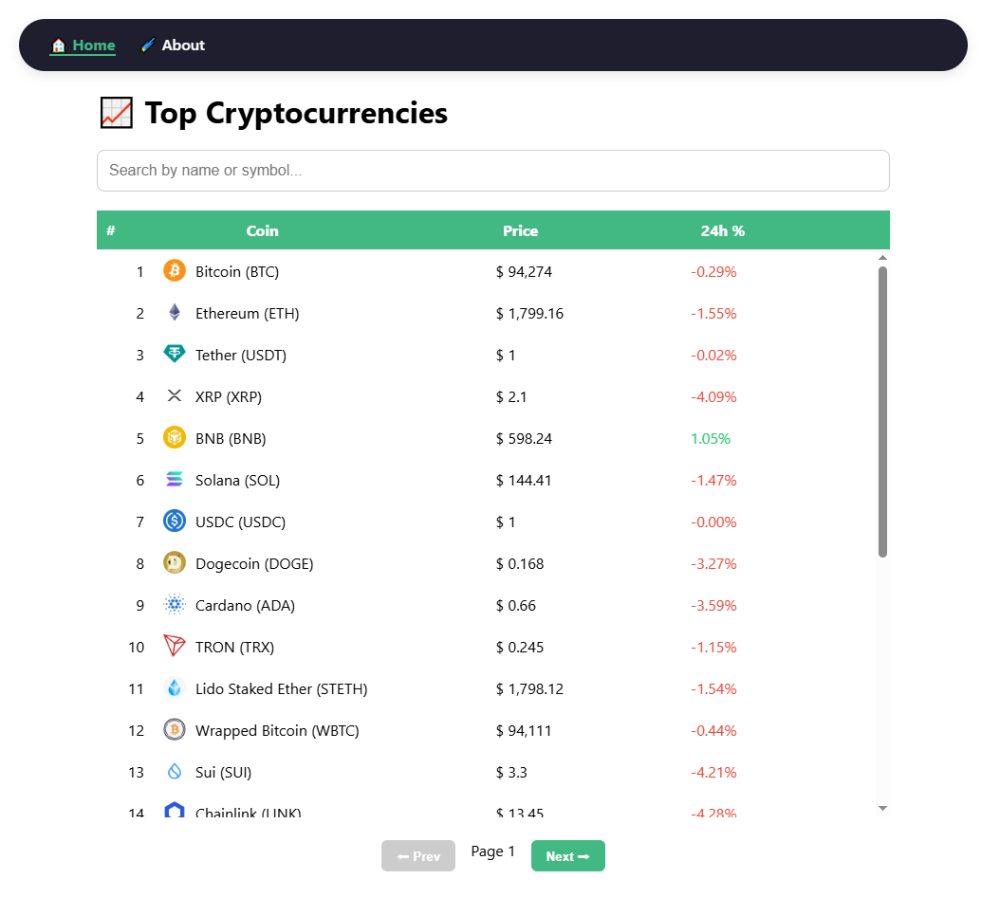

# 💰 Vue 3 Crypto Tracker

A real-time cryptocurrency tracking app built with **Vue 3**, **Vue Router**, and the powerful **Vue Query (TanStack Query)** for smart data fetching and caching.  
It uses the **CoinGecko API** to display prices, 24h % changes, and details for the top cryptocurrencies.

🔗 **Check out the live demo 👉**: [https://vue-gecko-crypto-tracking.netlify.app/](https://vue-gecko-crypto-tracking.netlify.app/)

---



---

## 🚀 Features

- 📈 Displays cryptocurrencies with live pricing
- 🔍 Search by name or symbol (across all results)
- 📄 Detailed coin view with market stats and description
- 📦 Pagination with persistent cache using **Vue Query**
- 🔁 Automatic retries and refetches on failure or tab focus
- 🔎 Global rank index per page and local index on search
- 🧠 Smart loading states with `isLoading` and `isFetching`
- 🖱 Click a row to view full coin details (using Vue Router)
- 📱 Responsive table with scrollable body and sticky headers

---

## 🛠 Tech Stack

| Technology        | Purpose                                |
|-------------------|-----------------------------------------|
| **Vue 3**         | Frontend framework                     |
| **Vue Router**    | Page navigation and dynamic routes     |
| **Vite**          | Fast build tool                        |
| **Vue Query**     | Data fetching, caching, and reactivity |
| **CoinGecko API** | Crypto market data (free, no API key)  |
| **Vanilla CSS**   | Styling and responsive layout          |

---

## 🧠 What I Learned

- Building multi-page apps with Vue Router
- Using route parameters like `/coin/:id`
- Vue Query's `useQuery()` for clean, reactive data fetching
- Handling errors, retries, and loading states like a pro
- Pagination UX + smart caching with `keepPreviousData`
- Creating a scrollable table with sticky headers
- Implementing global search across paginated data
- Cleanly separating paginated vs search logic

---

## 📦 Install & Run Locally

### 1. Clone the repo

```bash
git clone https://github.com/NurmuhammadMirov/vue-crypto-tracker.git
cd vue-crypto-tracker
```
### 2. Install dependencies

```bash
npm install
```
### 3. Start the dev server

```bash
npm run dev
```
Visit http://localhost:5173 in your browser 🚀

## 📘 API Credit
Data is provided by the [CoinGecko API](https://api.coingecko.com/api/v3/coins/markets?vs_currency=usd&order=market_cap_desc&per_page=250&page=1) — free and open without a key.

Made with ❤️ while learning Vue 3